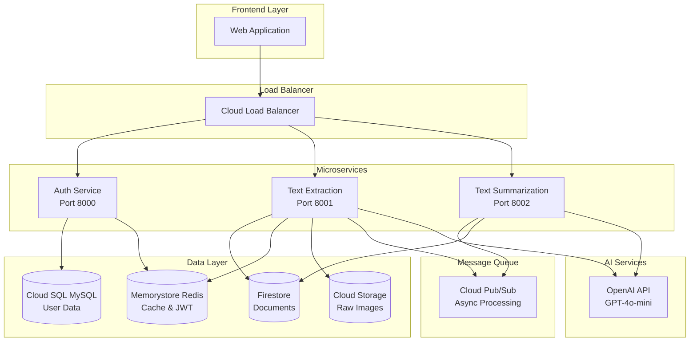

# 🧠 Document Intelligence Platform

A production-ready, cloud-native document processing platform built with microservices architecture on Google Cloud Platform, featuring AI-powered text extraction and summarization capabilities.

## 🏗️ Architecture Overview



## ✨ Features

### 🔐 **Authentication & Authorization**
- JWT-based authentication with 2-hour expiration
- Secure logout with token blacklisting
- User profile management (update email, username, password)
- Password hashing with bcrypt

### 📄 **Document Processing**
- **Cloud Storage-first strategy**: Raw images stored securely before processing
- **AI-powered text extraction** using OpenAI GPT-4o-mini
- **Asynchronous summarization** via Cloud Pub/Sub message queues
- **Redis caching** for fast retrieval of recent extractions
- **Complete lifecycle tracking** with status updates

### 🚀 **Production-Ready Infrastructure**
- **Container orchestration** with Google Kubernetes Engine (GKE)
- **Auto-scaling** based on CPU and queue depth
- **Load balancing** with Cloud Load Balancer
- **Multi-zone deployment** for high availability
- **Infrastructure as Code** with Terraform

## 🛠️ Technology Stack

| Component | Technology | Purpose |
|-----------|------------|---------|
| **Backend** | FastAPI + Python 3.11 | High-performance async APIs |
| **Authentication** | JWT + Redis | Secure token management |
| **Databases** | Cloud SQL MySQL + Firestore | Relational & document data |
| **Caching** | Memorystore Redis | Fast data retrieval |
| **Message Queue** | Cloud Pub/Sub | Async processing |
| **Storage** | Cloud Storage | Raw image storage |
| **AI Processing** | OpenAI GPT-4o-mini | Text extraction & summarization |
| **Container Platform** | Google Kubernetes Engine | Kubernetes orchestration |
| **Infrastructure** | Terraform | Infrastructure as Code |
| **CI/CD** | GitHub Actions | Automated deployments |

## 🚀 Quick Start

### Prerequisites
- Google Cloud Platform account with billing enabled
- Docker and Docker Compose
- Terraform >= 1.3.2
- kubectl
- gcloud CLI
- Python 3.11+

### Local Development

1. **Clone the repository**
   ```bash
   git clone https://github.com/your-org/document-intelligence-platform.git
   cd document-intelligence-platform
   ```

2. **Set up environment variables**
   ```bash
   cp .env.example .env
   # Edit .env with your configuration
   ```

3. **Start local services**
   ```bash
   docker-compose up -d
   ```

4. **Run the services**
   ```bash
   # Terminal 1: Auth Service
   cd user_auth && python main.py

   # Terminal 2: Text Extraction Service  
   cd text_extraction && python main.py

   # Terminal 3: Text Summarization Service
   cd text_summarization && python main.py
   ```

### Production Deployment

The application uses GitHub Actions for CI/CD with automatic deployment to AWS EKS.

1. **Fork this repository**

2. **Configure GitHub Secrets**
   ```
   AWS_ACCESS_KEY_ID=your_access_key
   AWS_SECRET_ACCESS_KEY=your_secret_key
   AWS_ACCOUNT_ID=your_account_id
   OPENAI_API_KEY=your_openai_key
   JWT_SECRET_KEY=your_jwt_secret
   ```

3. **Push to main branch**
   ```bash
   git push origin main
   ```

   This triggers the CD pipeline which:
   - 🏗️ Provisions AWS infrastructure with Terraform
   - 🐳 Builds and pushes Docker images to ECR
   - ☸️ Deploys to EKS cluster
   - ✅ Runs end-to-end tests

## 📋 API Documentation

### Authentication Endpoints
| Method | Endpoint | Description |
|--------|----------|-------------|
| `POST` | `/auth/register` | Register new user |
| `POST` | `/auth/token` | Login (get JWT token) |
| `POST` | `/auth/logout` | Logout (invalidate token) |
| `GET` | `/auth/users/me` | Get user profile |
| `PUT` | `/auth/users/me` | Update user profile |
| `POST` | `/auth/users/me/change-password` | Change password |

### Document Processing Endpoints
| Method | Endpoint | Description |
|--------|----------|-------------|
| `POST` | `/extract/image_text` | Upload & extract text |
| `GET` | `/extract/documents` | List user documents |
| `GET` | `/extract/document/{name}` | Get document details |

### Health Check Endpoints
| Method | Endpoint | Description |
|--------|----------|-------------|
| `GET` | `/auth/health` | Auth service health |
| `GET` | `/extract/health` | Extraction service health |
| `GET` | `/health` | Summarization service health |

## 🧪 Testing

### Run Tests Locally
```bash
# Unit tests
python -m pytest user_auth/tests/ -v
python -m pytest text_extraction/tests/ -v
python -m pytest text_summarization/tests/ -v

# Integration tests
python -m pytest tests/integration/ -v

# End-to-end tests
API_BASE_URL=http://localhost:8000 python -m pytest tests/e2e/ -v
```

### CI/CD Pipeline
- ✅ **Development Branch**: Unit tests, integration tests, security scans
- ✅ **Main Branch**: Full deployment pipeline with E2E tests

## 🏗️ Infrastructure

### AWS Resources Created
- **EKS Cluster** with managed node groups
- **RDS MySQL** for user data
- **DocumentDB** for document storage
- **ElastiCache Redis** for caching and JWT blacklist
- **S3 Bucket** for raw image storage
- **SQS Queue** for async processing
- **Application Load Balancer** for traffic routing
- **ECR Repositories** for container images

### Terraform Modules
```
terraform/
├── 01-main.tf              # Provider configuration
├── 02-variables.tf         # Input variables
├── 03-vpc.tf              # VPC and networking
├── 04-eks.tf              # EKS cluster
├── 05-databases.tf        # RDS and DocumentDB
├── 06-ecr.tf              # Container registry
├── 07-secrets.tf          # AWS Secrets Manager
├── 08-iam.tf              # IAM roles and policies
├── 09-outputs.tf          # Output values
├── 10-redis.tf            # ElastiCache Redis
├── 11-sqs.tf              # SQS queues
└── 15-user-images-storage.tf # S3 bucket
```

## 🔒 Security Features

- **🔐 JWT Authentication** with secure logout
- **🛡️ Token Blacklisting** in Redis
- **🔒 Secrets Management** with AWS Secrets Manager
- **🚫 Network Isolation** with VPC private subnets
- **👤 Non-root Containers** for security
- **🔍 Security Scanning** in CI pipeline
- **📊 Audit Logging** with AWS CloudTrail

## 📊 Monitoring & Observability

- **Health Checks** for all services
- **Auto-scaling** based on metrics
- **CloudWatch Metrics** and alarms
- **Container Health Checks** with Docker
- **Load Balancer Health Checks**

## 🤝 Contributing

1. Fork the repository
2. Create a feature branch: `git checkout -b feature/amazing-feature`
3. Make your changes and add tests
4. Run the test suite: `pytest`
5. Commit your changes: `git commit -m 'Add amazing feature'`
6. Push to the branch: `git push origin feature/amazing-feature`
7. Open a Pull Request

## 📄 License

This project is licensed under the MIT License - see the [LICENSE](LICENSE) file for details.

## 🆘 Support

- 📧 **Email**: support@your-domain.com
- 📖 **Documentation**: [docs.your-domain.com](https://docs.your-domain.com)
- 🐛 **Issues**: [GitHub Issues](https://github.com/your-org/document-intelligence-platform/issues)

---

**Built with ❤️ for production-scale document intelligence**

## 📄 Latest Features
- PDF Processing: Upload and extract text from PDF files (up to 10MB, 20 pages)
- Enhanced document management with file type detection
- Optimized for cost-effective deployment on t3.medium instances

# Trigger deployment - Tue Sep 16 19:07:13 IST 2025
- Fixing errors