# 🔐 Secrets Management Architecture

This document explains how secrets are managed across different layers of the Document Intelligence Platform, ensuring security best practices and separation of concerns.

## 🏗️ Architecture Overview

```mermaid
graph TB
    subgraph "Development & CI/CD Layer"
        DEV[Developer Machine]
        GH[GitHub Repository]
        GH_SECRETS[GitHub Secrets<br/>🔑 OPENAI_API_KEY<br/>🔑 JWT_SECRET_KEY<br/>🔑 AWS_ACCESS_KEY_ID<br/>🔑 AWS_SECRET_ACCESS_KEY<br/>🔑 AWS_ACCOUNT_ID]
        ACTIONS[GitHub Actions<br/>CI/CD Pipeline]
    end
    
    subgraph "Infrastructure Layer"
        TF[Terraform<br/>Infrastructure as Code]
        AWS_SM[AWS Secrets Manager<br/>🔐 MySQL passwords<br/>🔐 DocumentDB passwords<br/>🔐 Connection strings<br/>🔐 Auto-generated secrets]
    end
    
    subgraph "AWS Services"
        RDS[(RDS MySQL<br/>User Authentication)]
        DOCDB[(DocumentDB<br/>Document Storage)]
        REDIS[(ElastiCache Redis<br/>Cache & JWT Blacklist)]
    end
    
    subgraph "Kubernetes Cluster (EKS)"
        ESO[External Secrets Operator<br/>🔄 Syncs AWS → K8s]
        K8S_SECRETS[Kubernetes Secrets<br/>📦 Runtime secrets for pods]
        
        subgraph "Application Pods"
            AUTH_POD[Auth Service]
            EXTRACT_POD[Text Extraction Service]
            SUMMARY_POD[Text Summarization Service]
        end
    end
    
    %% Connections
    DEV --> GH
    GH --> GH_SECRETS
    GH_SECRETS --> ACTIONS
    ACTIONS --> TF
    
    TF --> AWS_SM
    TF --> RDS
    TF --> DOCDB
    TF --> REDIS
    
    AWS_SM --> ESO
    ESO --> K8S_SECRETS
    
    K8S_SECRETS --> AUTH_POD
    K8S_SECRETS --> EXTRACT_POD
    K8S_SECRETS --> SUMMARY_POD
    
    RDS -.-> AUTH_POD
    DOCDB -.-> EXTRACT_POD
    DOCDB -.-> SUMMARY_POD
    REDIS -.-> AUTH_POD
    REDIS -.-> EXTRACT_POD
    
    %% Styling
    classDef secrets fill:#ff6b6b,stroke:#d63031,color:#fff
    classDef aws fill:#ff9f43,stroke:#e17055,color:#fff
    classDef k8s fill:#74b9ff,stroke:#0984e3,color:#fff
    classDef apps fill:#55a3ff,stroke:#2d3436,color:#fff
    
    class GH_SECRETS,AWS_SM,K8S_SECRETS secrets
    class RDS,DOCDB,REDIS,TF aws
    class ESO,AUTH_POD,EXTRACT_POD,SUMMARY_POD k8s
```



## 🔑 Secret Categories

### **1. Build-Time Secrets (GitHub Secrets)**
These secrets are used during the CI/CD pipeline and infrastructure deployment:

| Secret Name | Purpose | Used By | Security Level |
|-------------|---------|---------|----------------|
| `OPENAI_API_KEY` | OpenAI API access for text processing | Terraform → AWS Secrets Manager | 🔴 Critical |
| `JWT_SECRET_KEY` | JWT token signing and validation | Terraform → AWS Secrets Manager | 🔴 Critical |
| `AWS_ACCESS_KEY_ID` | AWS API access for deployment | GitHub Actions | 🟡 High |
| `AWS_SECRET_ACCESS_KEY` | AWS API secret key | GitHub Actions | 🟡 High |
| `AWS_ACCOUNT_ID` | AWS account identifier | GitHub Actions | 🟢 Medium |

### **2. Runtime Secrets (AWS Secrets Manager)**
These secrets are auto-generated by Terraform and used by running applications:

| Secret Name | Purpose | Auto-Generated | Rotation |
|-------------|---------|----------------|----------|
| `doc-intel/mysql-root-password` | MySQL root access | ✅ Yes | 🔄 Supported |
| `doc-intel/mysql-user-password` | MySQL application user | ✅ Yes | 🔄 Supported |
| `doc-intel/docdb-master-password` | DocumentDB master access | ✅ Yes | 🔄 Supported |
| `doc-intel/openai-key` | OpenAI API key (from GitHub) | ❌ No | 🔄 Manual |
| `doc-intel/jwt-key` | JWT signing key (from GitHub) | ❌ No | 🔄 Manual |

### **3. Kubernetes Secrets (Runtime)**
These are synced from AWS Secrets Manager by External Secrets Operator:

| Kubernetes Secret | Namespace | Consumed By | Sync Frequency |
|------------------|-----------|-------------|----------------|
| `mysql-credentials` | `doc-intel-app` | Auth Service | Every 15s |
| `docdb-credentials` | `doc-intel-app` | Text Extraction, Summarization | Every 15s |
| `redis-credentials` | `doc-intel-app` | All Services | Every 15s |
| `openai-credentials` | `doc-intel-app` | Text Extraction, Summarization | Every 15s |
| `jwt-credentials` | `doc-intel-app` | Auth Service | Every 15s |

## 🔄 Secret Lifecycle

### **Development → Production Flow**


## 🛡️ Security Best Practices

### **✅ What We Do Right**

1. **🚫 No Hardcoded Secrets**: All secrets are externalized
2. **🔐 Encryption at Rest**: AWS Secrets Manager encrypts all secrets
3. **🔄 Automatic Rotation**: Database passwords can be rotated automatically
4. **👁️ Audit Trail**: AWS CloudTrail logs all secret access
5. **🎯 Principle of Least Privilege**: Each service only gets the secrets it needs
6. **📦 Namespace Isolation**: Kubernetes secrets are scoped to specific namespaces
7. **🔒 Transit Encryption**: All secret transmission is encrypted (TLS)

### **🔍 Secret Access Patterns**

| Service | MySQL | DocumentDB | Redis | OpenAI | JWT |
|---------|-------|------------|-------|--------|-----|
| **Auth Service** | ✅ Read/Write | ❌ No Access | ✅ Read/Write | ❌ No Access | ✅ Sign/Verify |
| **Text Extraction** | ❌ No Access | ✅ Read/Write | ✅ Read/Write | ✅ API Calls | ✅ Verify Only |
| **Text Summarization** | ❌ No Access | ✅ Read/Write | ❌ No Access | ✅ API Calls | ❌ No Access |

## 🚀 Deployment Process

### **1. Initial Setup**
```bash
# Set up GitHub Secrets (one-time)
gh secret set OPENAI_API_KEY --body "sk-your-key-here"
gh secret set JWT_SECRET_KEY --body "$(openssl rand -hex 32)"
gh secret set AWS_ACCESS_KEY_ID --body "your-access-key"
gh secret set AWS_SECRET_ACCESS_KEY --body "your-secret-key"
gh secret set AWS_ACCOUNT_ID --body "123456789012"
```

### **2. Infrastructure Deployment**
When you push to `main`, GitHub Actions:
1. Uses GitHub Secrets to authenticate with AWS
2. Runs Terraform with secret variables
3. Terraform creates AWS Secrets Manager entries
4. Database passwords are auto-generated securely

### **3. Application Runtime**
When pods start:
1. External Secrets Operator syncs AWS → Kubernetes
2. Kubernetes mounts secrets as environment variables
3. Applications read secrets from environment
4. No secrets are ever logged or exposed

## 🔧 Troubleshooting

### **Common Issues & Solutions**

#### **❌ Pod can't connect to database**
```bash
# Check if secrets are synced
kubectl get secrets -n doc-intel-app

# Check External Secrets Operator logs
kubectl logs -n external-secrets-system deployment/external-secrets

# Verify secret content (base64 encoded)
kubectl get secret mysql-credentials -n doc-intel-app -o yaml
```

#### **❌ External Secrets Operator not syncing**
```bash
# Check ESO status
kubectl get externalsecrets -n doc-intel-app

# Check AWS IAM permissions
aws sts get-caller-identity

# Verify AWS Secrets Manager access
aws secretsmanager list-secrets --region ap-south-1
```

#### **❌ GitHub Actions failing with AWS permissions**
- Verify `AWS_ACCESS_KEY_ID` and `AWS_SECRET_ACCESS_KEY` in GitHub Secrets
- Check IAM user has necessary permissions for Terraform operations
- Ensure AWS account ID is correct in `AWS_ACCOUNT_ID` secret

## 📊 Monitoring & Auditing

### **Secret Access Monitoring**
- **AWS CloudTrail**: Logs all AWS Secrets Manager API calls
- **Kubernetes Audit Logs**: Track secret access within cluster
- **Application Logs**: Monitor connection failures (without exposing secrets)

### **Security Metrics**
- Secret rotation frequency
- Failed authentication attempts
- Unauthorized secret access attempts
- Certificate expiration dates

## 🔄 Secret Rotation

### **Automatic Rotation (Recommended)**
```bash
# Enable automatic rotation for RDS
aws secretsmanager update-secret \
    --secret-id doc-intel/mysql-user-password \
    --description "MySQL user password with auto-rotation" \
    --replica-regions Region=ap-south-1
```

### **Manual Rotation Process**
1. **Update secret in AWS Secrets Manager**
2. **External Secrets Operator automatically syncs** (within 15 seconds)
3. **Restart application pods** to pick up new secrets
4. **Verify connectivity** with new credentials

## 📚 References

- [AWS Secrets Manager Best Practices](https://docs.aws.amazon.com/secretsmanager/latest/userguide/best-practices.html)
- [External Secrets Operator Documentation](https://external-secrets.io/)
- [Kubernetes Secrets Security](https://kubernetes.io/docs/concepts/security/secrets-good-practices/)
- [GitHub Secrets Documentation](https://docs.github.com/en/actions/security-guides/encrypted-secrets)

---

**🔐 Remember**: Secrets are the keys to your kingdom. Handle them with the utmost care and never commit them to version control!
